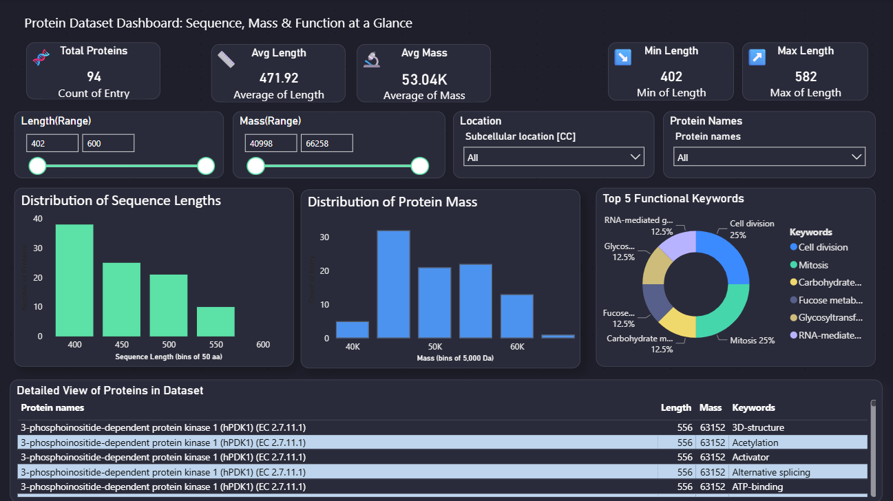

# Human Proteome Dashboard

**Dashboard for exploring human protein data with Power BI.**  
Built on top of the EDA from the [`eda-human-proteome`](https://github.com/NahidRH/EDA_human_proteome) project.

This interactive dashboard enables users to visually explore protein attributes such as mass, sequence length, subcellular location, and functional keywords — based on UniProt's human proteome dataset.

---

## 📊 Features

- Key Protein Metrics (Total, Avg, Min/Max Mass and Length)
- Histogram Charts for Mass and Sequence Length (binned)
- Pie Charts for Subcellular Location and Functional Keywords
- Interactive Slicers for filtering by protein name, location, and more
- Clean dark-themed design, optimized for readability and clarity

---

## 🔧 Requirements

- [Power BI Desktop](https://powerbi.microsoft.com/desktop/) (latest version recommended)
- No additional packages needed — just open the `.pbix` file

---

## 📁 Files

| File                          | Description                          |
|-------------------------------|--------------------------------------|
| `ProteinDashboard.pbix`       | Main dashboard file (Power BI)       |
| `sample_uniprot_100.tsv`             | Sample of the original UniProt data  |
| `screenshots/`                | Dashboard screenshots                |

---

## 🧬 Data Source

- Human proteome dataset from [UniProt](https://www.uniprot.org/)
- Dataset originally prepared and cleaned in the [`eda-human-proteome`](https://github.com/NahidRH/EDA_human_proteome) project

---

## 🖼 Sample Preview

---

## 📄 License

This project is open-source and available under the [MIT License](LICENSE).

---

## 🔗 Related Projects

- [`eda-human-proteome`](https://github.com/NahidRH/EDA_human_proteome): Exploratory data analysis of the human proteome using Python and Pandas.

